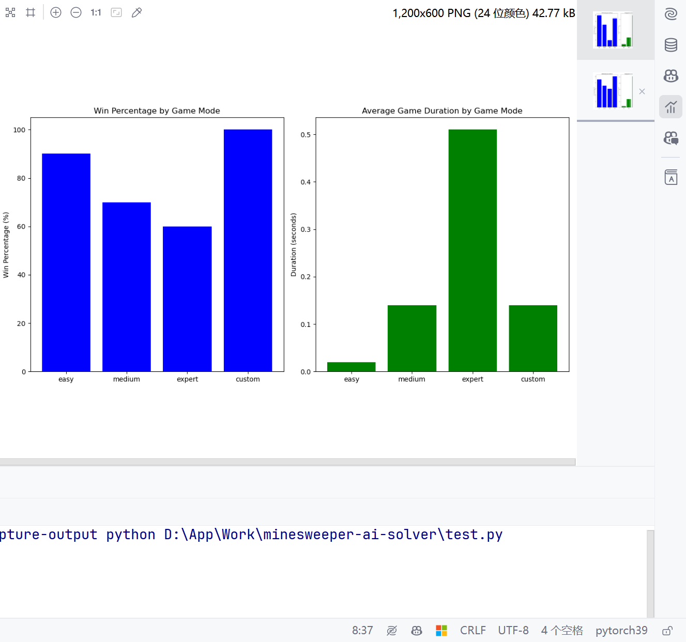
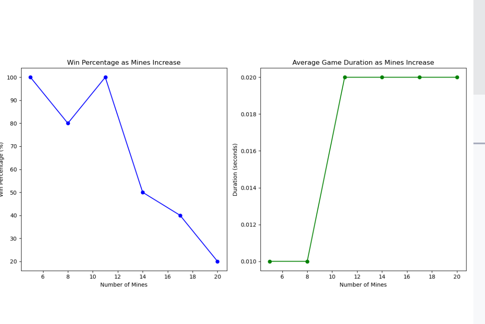

# 本文基于PyTorch构建，利用多层卷积神经网络来解决扫雷的问题  

本文基于如下项目的目录结构：  

```text
Mode                 LastWriteTime         Length Name
----                 -------------         ------ ----
d----            2024/5/6    15:14                .idea
d----            2024/5/2    13:40                minesweeper_cnn_solver
d----            2024/5/2    19:49                minesweeper_game
d----            2024/5/2    19:43                minesweeper_traditional_solver
d----            2024/5/2    13:27                trained_models
-a---            2024/5/2    13:27             60 .gitignore
-a---            2024/5/2    13:27           1526 LICENSE
-a---            2024/5/2    13:27           4307 play_minesweeper.py
-a---            2024/5/6    14:50           4987 play_traditional_minesweeper.py
-a---            2024/5/6    15:17           1587 README.ipynb
-a---            2024/5/2    13:27             52 requirements.txt
-a---            2024/5/2    13:27           2460 train_model.py
```  
游戏本体被放置在`minesweeper_game` 目录下面，包括了游戏的逻辑和界面。  

## 1. 采用神经网络解开扫雷游戏   
如果你拿到了整个项目，你将在`minesweeper_cnn_solver`目录看到整个问题的解决方案。  
下面是我的模型结构：
+ 使用了多层卷积层，每一层后都接一个ReLU激活函数，以增强模型的非线性处理能力。这种结构有助于从输入的棋盘数据中学习复杂的空间层级特征。
+ 模型的输入是具有11个通道的数据，这代表了棋盘的各种特征，如已知的地雷位置、安全区域、以及其他游戏状态指标。
+ 最终通过一个1x1卷积和Sigmoid激活函数输出一个概率矩阵，表示每个单元格被认为是雷的概率。  

## 模型的数据来源
模型的数据源来自于目录 `minesweeper_game` 中的游戏，模型通过不断的运行每一局游戏达到训练的效果，使用如下代码训练模型：  
```shell
 python train_model.py --game-mode=classic --training-iterations=10 --epochs=4 --batches=5 --batch-size=200
```


下面是其中的部分代码：

1. **卷积层堆叠**:
   这部分是模型的核心，包括多层卷积和ReLU激活函数。这是在模型定义中的`__init__`方法里，具体代码如下：

```python
self._model = torch.nn.Sequential(
    torch.nn.Conv2d(in_channels=11, out_channels=64, kernel_size=3, padding='same', dtype=dtype),
    torch.nn.ReLU(),
    torch.nn.Conv2d(in_channels=64, out_channels=64, kernel_size=3, padding='same', dtype=dtype),
    torch.nn.ReLU(),
    torch.nn.Conv2d(in_channels=64, out_channels=64, kernel_size=3, padding='same', dtype=dtype),
    torch.nn.ReLU(),
    torch.nn.Conv2d(in_channels=64, out_channels=64, kernel_size=3, padding='same', dtype=dtype),
    torch.nn.ReLU(),
    torch.nn.Conv2d(in_channels=64, out_channels=64, kernel_size=3, padding='same', dtype=dtype),
    torch.nn.ReLU(),
    torch.nn.Conv2d(in_channels=64, out_channels=1, kernel_size=1, padding='same', dtype=dtype),
    torch.nn.Sigmoid()
)
```

2. **前向传播**:
   这是模型如何处理输入数据并输出结果的过程，位于`forward`方法中。代码如下：

```python
def forward(self, x):
    x = self._model(x)
    output_shape = (x.size()[0],) + x.size()[2:]
    return x.view(output_shape)
```

3. **模型保存**:
   将训练好的模型参数保存到文件中：

```python
def save(self, path):
    torch.save(self._model.state_dict(), path)
```

4. **模型加载**:
   加载已保存模型的参数，此功能在`fromfile`静态方法中实现：

```python
@staticmethod
def fromfile(path):
    model = MinesweeperSolverModel()
    model._model.load_state_dict(torch.load(path))
    return model
```

## 2. 采用传统技术解决扫雷游戏
你将在`minesweeper_traditional_solver`目录看到采用传统技术解决扫雷游戏的解决方案。

下面是其核心代码：  
```python
def solve(self):
    self.changed = False
    for row in range(self.game.mode().height()):
        for col in range(self.game.mode().width()):
            current_cell = self.game.field()[row, col]
            if current_cell in range(1, 9):
                num_flagged = sum(
                    self.game.field()[r, c] == CellState.MINE for r, c in self.get_neighbors(row, col))
                num_closed = sum(
                    self.game.field()[r, c] == CellState.CLOSED for r, c in self.get_neighbors(row, col))
                clue = current_cell

                # print(f"Processing cell ({row}, {col}): clue={clue}, flagged={num_flagged}, closed={num_closed}")

                if clue == num_flagged:
                    for r, c in self.get_neighbors(row, col):
                        if self.game.field()[r, c] == CellState.CLOSED:
                            idx = np.ravel_multi_index((r, c), self.game.field().shape)
                            self.game.open(idx)
                            # print(f"Opened cell ({r}, {c}) based on clue match.")
                            self.changed = True
                elif clue == num_closed + num_flagged:
                    for r, c in self.get_neighbors(row, col):
                        if self.game.field()[r, c] == CellState.CLOSED:
                            mine_idx = np.ravel_multi_index((r, c), self.game.field().shape)
                            self.marked_mines.add(mine_idx)
                            # print(f"Marked cell ({r}, {c}) as mine.")
```


# 3. 两者的性能比较，解答效果的比较  
在我的测试中，我发现传统技术在处理小型棋盘时表现良好(性能方面)，但在处理大型棋盘时解决率下降明显。且传统方式无论在小型棋盘还是大型棋盘，解答的准确率都不如神经网络。这是因为传统技术依赖于规则和启发式方法，而这些方法在处理复杂的情况时可能会失效。  
如何测试传统方式与神经网络方式的效果呢？  
你可以根据如下参数运行命令行命令：  
```python
parser = argparse.ArgumentParser(description='Play Minesweeper game simulation using pretrained model.')
parser.add_argument('-g', '--game-mode', help='The Minesweeper game mode to play.',
                    default='classic', choices=['classic', 'easy', 'medium', 'expert', 'custom'])
parser.add_argument('-c', '--custom-mode', help='The configuration of the custom game mode in the following format:'
                                                ' {field width}x{field height}x{number of mines}, e.g.: 8x8x8.',
                    default=None)
parser.add_argument('-m', '--model', help='The path to pretrained model.',
                    default=None)
parser.add_argument('-n', '--number-of-games', help='The number of time the games is played.',
                    default=1, type=int)
parser.add_argument('-o', '--output-mode', help='The output mode.',
                    default='demo', choices=['demo', 'log', 'statistics-only'])
```  

在你的命令行运行如下命令测试传统方式与神经网络方式的效果：    
处理简单的棋盘问题(神经网络)：
```shell
 python .\play_minesweeper.py -n 100 --game-mode custom --custom-mode 8x8x8 -o statistics-only
```

运行结果如下:
```text
Statistics:
 Games played: 100
 Games won: 93
 Win percentage: 93.00%
 Average game duration: 0.01 seconds
 Sum Game Duration: 1.45 seconds
```

处理简单的棋盘问题(传统方式):
```shell
 python .\play_traditional_minesweeper.py -n 100 --game-mode custom --custom-mode 8x8x8 -o statistics-only
```
传统方式的运行结果：  
```text
Statistics:
 Games played: 100
 Games won: 44
 Win percentage: 0.44
 Average game duration: 0.00 seconds
 Sum Game Duration: 0.19 seconds
```
我们可以看出传统方式在运行效率上要优于神经网络，但在解答效果上神经网络要优于传统方式。  

下面我们换更大一点的棋盘问题来测试：  
处理复杂的棋盘问题(神经网络)：
```shell
 python .\play_minesweeper.py -n 100 --game-mode custom --custom-mode 16x16x40 -o statistics-only
```

解答结果：
```text
Statistics:
 Games played: 100
 Games won: 81
 Win percentage: 81.00%
 Average game duration: 0.13 seconds
 Sum Game Duration: 13.01 seconds
```

处理复杂的棋盘问题(传统方式):
```shell
 python .\play_traditional_minesweeper.py -n 100 --game-mode custom --custom-mode 16x16x40 -o statistics-only
```
运行结果如下：  
```text
Statistics:
 Games played: 100
 Games won: 12
 Win percentage: 0.12
 Average game duration: 0.03 seconds
 Sum Game Duration: 3.50 seconds
```

我们可以看出传统方式在处理复杂的棋盘问题时，解答效果和运行效率都不如神经网络。  

# 不同难度之下的神经网络的效果对比
实验代码如下：  

```python
import subprocess
import re
import matplotlib.pyplot as plt

# 定义游戏配置
configs = [
    {'mode': 'easy', 'games': 10},
    {'mode': 'medium', 'games': 10},
    {'mode': 'expert', 'games': 10},
    {'mode': 'custom', 'custom_mode': '8x8x8', 'games': 10},
    {'mode': 'custom', 'custom_mode': '16x16x40', 'games': 10}
]

# 初始化数据收集变量
results = []

# 运行游戏脚本并收集结果
for config in configs:
    mode = config['mode']
    games = config['games']
    custom_mode = config.get('custom_mode', '')
    command = [
        'python', 'play_minesweeper.py',  # 调整为你的脚本文件名
        '--game-mode', mode,
        '--number-of-games', str(games),
        '--output-mode', 'statistics-only'
    ]
    if custom_mode:
        command.extend(['--custom-mode', custom_mode])

    # 运行脚本并捕获输出
    process = subprocess.run(command, capture_output=True, text=True)
    output = process.stdout

    # 解析输出
    win_pattern = r'Win percentage: (\d+.\d+)%'
    duration_pattern = r'Average game duration: (\d+.\d+) seconds'
    win_percent = float(re.search(win_pattern, output).group(1))
    avg_duration = float(re.search(duration_pattern, output).group(1))

    # 保存结果
    results.append({
        'mode': mode,
        'win_percent': win_percent,
        'avg_duration': avg_duration
    })

# 绘制胜率和平均游戏时间图表
modes = [result['mode'] for result in results]
win_percents = [result['win_percent'] for result in results]
avg_durations = [result['avg_duration'] for result in results]

plt.figure(figsize=(12, 6))
plt.subplot(1, 2, 1)
plt.bar(modes, win_percents, color='blue')
plt.title('Win Percentage by Game Mode')
plt.ylabel('Win Percentage (%)')

plt.subplot(1, 2, 2)
plt.bar(modes, avg_durations, color='green')
plt.title('Average Game Duration by Game Mode')
plt.ylabel('Duration (seconds)')

plt.tight_layout()
plt.show()
```

运行结果如下：  
  

将实验代码换成传统脚本：  
  

# 地雷不断增加下两种方案的对比  
实验代码如下：  
```python
import subprocess
import re
import matplotlib.pyplot as plt

# 设置自定义游戏模式的基本配置
base_width = 8
base_height = 8
min_mines = 5  # 最小地雷数
max_mines = 20  # 最大地雷数
mine_increment = 3  # 地雷数递增步长
games_per_config = 10  # 每种配置运行的游戏次数

# 初始化数据收集变量
results = []

# 逐步增加地雷数并运行游戏脚本收集结果
for mines in range(min_mines, max_mines + 1, mine_increment):
    custom_mode = f'{base_width}x{base_height}x{mines}'
    command = [
        'python', 'play_traditional_minesweeper.py',  # 调整为你的脚本文件名
        '--game-mode', 'custom',
        '--custom-mode', custom_mode,
        '--number-of-games', str(games_per_config),
        '--output-mode', 'statistics-only'
    ]

    # 运行脚本并捕获输出
    process = subprocess.run(command, capture_output=True, text=True)
    output = process.stdout

    # 解析输出
    win_pattern = r'Win percentage: (\d+.\d+)%'
    duration_pattern = r'Average game duration: (\d+.\d+) seconds'
    win_percent = float(re.search(win_pattern, output).group(1))
    avg_duration = float(re.search(duration_pattern, output).group(1))

    # 保存结果
    results.append({
        'mines': mines,
        'win_percent': win_percent,
        'avg_duration': avg_duration
    })

# 绘制胜率和平均游戏时间图表
mines_list = [result['mines'] for result in results]
win_percents = [result['win_percent'] for result in results]
avg_durations = [result['avg_duration'] for result in results]

plt.figure(figsize=(12, 6))
plt.subplot(1, 2, 1)
plt.plot(mines_list, win_percents, marker='o', linestyle='-', color='blue')
plt.title('Win Percentage as Mines Increase')
plt.xlabel('Number of Mines')
plt.ylabel('Win Percentage (%)')

plt.subplot(1, 2, 2)
plt.plot(mines_list, avg_durations, marker='o', linestyle='-', color='green')
plt.title('Average Game Duration as Mines Increase')
plt.xlabel('Number of Mines')
plt.ylabel('Duration (seconds)')

plt.tight_layout()
plt.show()
```

神经网络方式的实验结果如下：

神经网络方式在地雷增加的情况下，胜率下降，但平均解答时间增加。这是因为神经网络在处理复杂问题时，需要更多的时间来计算。

传统方式的实验结果如下：
  
传统解答方式在地雷增加的情况下，到后面平均解答时间减少，但胜率也在下降。这是因为传统方式在处理复杂问题时，很快就会失败。

从胜率上来看，传统方式在解决地雷增加的问题时，显然不如神经网络。

# 总结
在这篇综合实验和比较研究中，我们针对解决扫雷游戏的两种方法：传统算法和基于卷积神经网络（CNN）的方法，进行了详细的性能和效率比较。实验通过模拟不同难度和复杂度的扫雷游戏，观察了两种技术在不同条件下的表现。

### 实验设置和方法
我们设计了几组实验，包括固定棋盘大小而增加地雷数量的设置，以及改变棋盘大小和难度的多样化测试。使用Python脚本自动化运行游戏并收集数据，包括胜率和每局游戏的平均持续时间。

### 主要发现
1. **胜率对比**：
   - 在处理小型棋盘（如8x8）的简单问题时，神经网络的胜率显著高于传统算法。例如，当地雷数为8时，神经网络的胜率接近93%，而传统算法仅为44%。
   - 在处理更大型和更复杂的棋盘（如16x16，40个地雷）时，神经网络的胜率仍然保持较高水平（81%），而传统算法的胜率骤降至12%。

2. **运行效率对比**：
   - 在简单的棋盘配置中，尽管传统算法的解答时间更短，但其低胜率表明了效率并未转化为有效的解决策略。
   - 在复杂的棋盘配置中，神经网络虽然在计算上更耗时，但能够维持较高的胜率，显示出其在处理复杂问题时的优越性。

3. **地雷数量影响**：
   - 随着地雷数量的增加，神经网络和传统算法的胜率都有所下降，但神经网络的胜率下降较慢，表明其更好地适应了增加的游戏难度。
   - 神经网络在地雷数量增加时的解答时间增加，这可能是由于需要处理更多的信息和进行更复杂的推理。

### 结论
神经网络方法在解决扫雷游戏方面，特别是在面对复杂的棋盘配置时，明显优于传统算法。它不仅保持了较高的胜率，还表现出对复杂情况的更好适应性。虽然神经网络在时间效率上低于传统方法，但其在胜率和解答质量上的优势，使其成为解决复杂扫雷问题的首选技术。