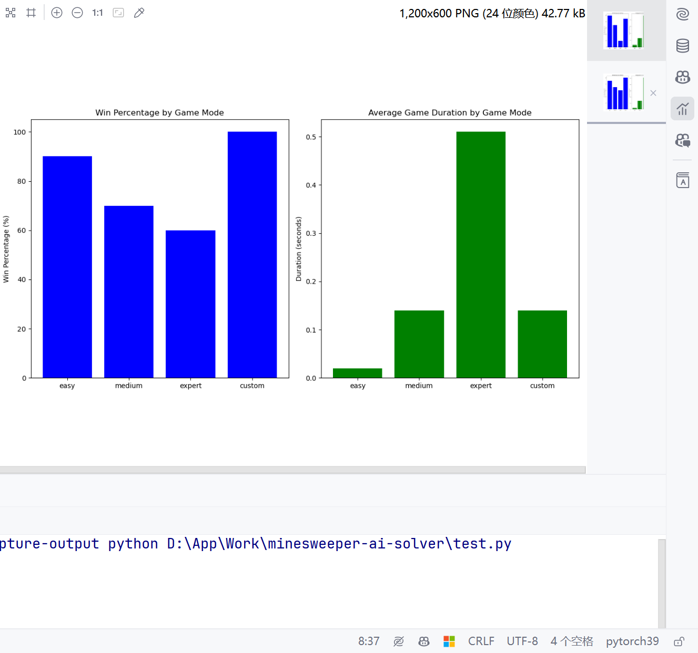
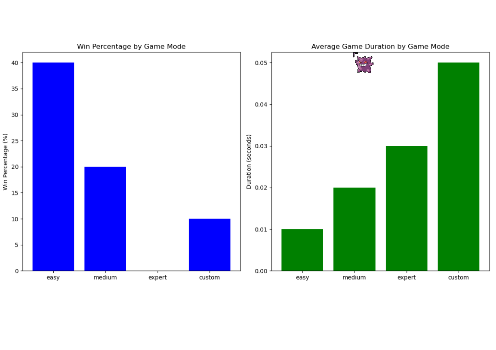
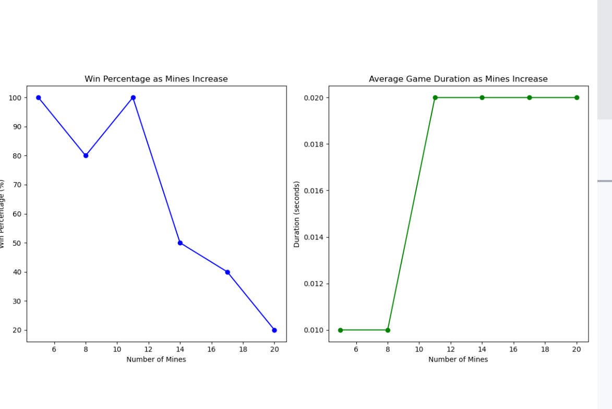
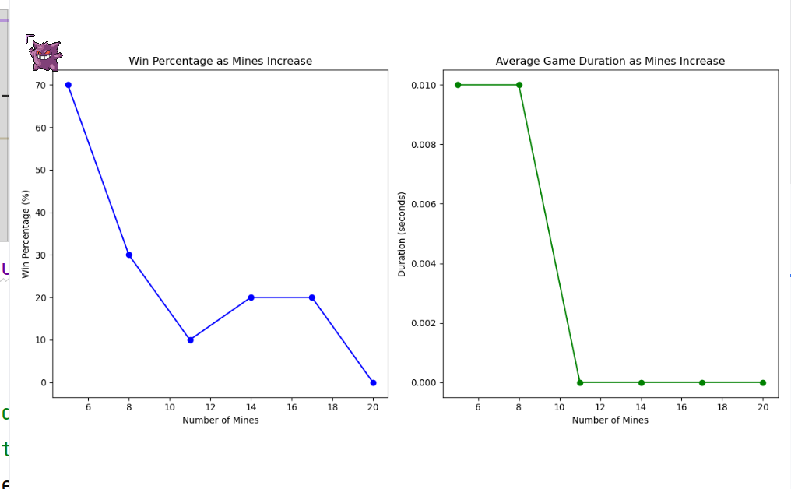

# This document is based on PyTorch, utilizing multi-layer convolutional neural networks to solve the Minesweeper problem

This document is based on the following project directory structure:  

```text
Mode                 LastWriteTime         Length Name
----                 -------------         ------ ----
d----            2024/5/6    15:14                .idea
d----            2024/5/2    13:40                minesweeper_cnn_solver
d----            2024/5/2    19:49                minesweeper_game
d----            2024/5/2    19:43                minesweeper_traditional_solver
d----            2024/5/2    13:27                trained_models
-a---            2024/5/2    13:27             60 .gitignore
-a---            2024/5/2    13:27           1526 LICENSE
-a---            2024/5/2    13:27           4307 play_minesweeper.py
-a---            2024/5/6    14:50           4987 play_traditional_minesweeper.py
-a---            2024/5/6    15:17           1587 README.ipynb
-a---            2024/5/2    13:27             52 requirements.txt
-a---            2024/5/2    13:27           2460 train_model.py
```  
The core game logic and interface are housed within the minesweeper_game directory.   

## 1. Solving Minesweeper Using Neural Networks 
If you have access to the entire project, the complete solution can be found within the minesweeper_cnn_solver directory.
Here is the structure of my model:
+ The model uses multiple convolutional layers, each followed by a ReLU activation function, to enhance the model's non-linear processing capabilities. This architecture aids in learning complex spatial hierarchies from the input board data.
+ The model inputs data with 11 channels, representing various features of the board such as known mine locations, safe areas, and other game state indicators.
+ The output is a probability matrix generated through a 1x1 convolution and Sigmoid activation function, indicating the likelihood of each cell being a mine. 

## Source of Data for the Model
The data for the model comes from the minesweeper_game directory. The model is trained by repeatedly playing games using the following command:
```shell
 python train_model.py --game-mode=classic --training-iterations=10 --epochs=4 --batches=5 --batch-size=200
```


Below are some parts of the code:  

1. **Convolutional Layer Stack**:
This is the core of the model, consisting of multiple convolutional layers followed by ReLU activations. It is defined within the __init__ method of the model.

```python
self._model = torch.nn.Sequential(
    torch.nn.Conv2d(in_channels=11, out_channels=64, kernel_size=3, padding='same', dtype=dtype),
    torch.nn.ReLU(),
    torch.nn.Conv2d(in_channels=64, out_channels=64, kernel_size=3, padding='same', dtype=dtype),
    torch.nn.ReLU(),
    torch.nn.Conv2d(in_channels=64, out_channels=64, kernel_size=3, padding='same', dtype=dtype),
    torch.nn.ReLU(),
    torch.nn.Conv2d(in_channels=64, out_channels=64, kernel_size=3, padding='same', dtype=dtype),
    torch.nn.ReLU(),
    torch.nn.Conv2d(in_channels=64, out_channels=64, kernel_size=3, padding='same', dtype=dtype),
    torch.nn.ReLU(),
    torch.nn.Conv2d(in_channels=64, out_channels=1, kernel_size=1, padding='same', dtype=dtype),
    torch.nn.Sigmoid()
)
```

2. **Forward Propagation**:
This method describes how the model processes input data and outputs results, located in the forward method.

```python
def forward(self, x):
    x = self._model(x)
    output_shape = (x.size()[0],) + x.size()[2:]
    return x.view(output_shape)
```

3. **Model Saving**:
This function saves the trained model parameters to a file.

```python
def save(self, path):
    torch.save(self._model.state_dict(), path)
```

4. **Model Loading**:
This function loads saved model parameters, implemented in the fromfile static method.

```python
@staticmethod
def fromfile(path):
    model = MinesweeperSolverModel()
    model._model.load_state_dict(torch.load(path))
    return model
```

## 2. Solving Minesweeper Using Traditional Techniques
The `minesweeper_traditional_solver` directory contains solutions using traditional techniques for solving Minesweeper.

Here is the core code:  
```python
def solve(self):
    self.changed = False
    for row in range(self.game.mode().height()):
        for col in range(self.game.mode().width()):
            current_cell = self.game.field()[row, col]
            if current_cell in range(1, 9):
                num_flagged = sum(
                    self.game.field()[r, c] == CellState.MINE for r, c in self.get_neighbors(row, col))
                num_closed = sum(
                    self.game.field()[r, c] == CellState.CLOSED for r, c in self.get_neighbors(row, col))
                clue = current_cell

                # print(f"Processing cell ({row}, {col}): clue={clue}, flagged={num_flagged}, closed={num_closed}")

                if clue == num_flagged:
                    for r, c in self.get_neighbors(row, col):
                        if self.game.field()[r, c] == CellState.CLOSED:
                            idx = np.ravel_multi_index((r, c), self.game.field().shape)
                            self.game.open(idx)
                            # print(f"Opened cell ({r}, {c}) based on clue match.")
                            self.changed = True
                elif clue == num_closed + num_flagged:
                    for r, c in self.get_neighbors(row, col):
                        if self.game.field()[r, c] == CellState.CLOSED:
                            mine_idx = np.ravel_multi_index((r, c), self.game.field().shape)
                            self.marked_mines.add(mine_idx)
                            # print(f"Marked cell ({r}, {c}) as mine.")
```


# 3. Performance Comparison Between the Two Methods  
In my testing, I found that the traditional technique performs well on small boards in terms of efficiency but has a significant drop in resolution rates on larger boards. Also, the accuracy of solutions from the traditional method is lower than that of the neural network on both small and large boards. This is because traditional techniques rely on rules and heuristics that may fail in complex situations.

How to test the effectiveness of traditional methods versus neural network methods?
You can run the command line commands according to the following parameters: 
```python
parser = argparse.ArgumentParser(description='Play Minesweeper game simulation using pretrained model.')
parser.add_argument('-g', '--game-mode', help='The Minesweeper game mode to play.',
                    default='classic', choices=['classic', 'easy', 'medium', 'expert', 'custom'])
parser.add_argument('-c', '--custom-mode', help='The configuration of the custom game mode in the following format:'
                                                ' {field width}x{field height}x{number of mines}, e.g.: 8x8x8.',
                    default=None)
parser.add_argument('-m', '--model', help='The path to pretrained model.',
                    default=None)
parser.add_argument('-n', '--number-of-games', help='The number of time the games is played.',
                    default=1, type=int)
parser.add_argument('-o', '--output-mode', help='The output mode.',
                    default='demo', choices=['demo', 'log', 'statistics-only'])
```  

In your command line, run the following commands to test the effectiveness of traditional methods versus neural network methods:

Handling a simple board problem (neural network):
```shell
 python .\play_minesweeper.py -n 100 --game-mode custom --custom-mode 8x8x8 -o statistics-only
```

Traditional method running result:
```text
Statistics:
 Games played: 100
 Games won: 93
 Win percentage: 93.00%
 Average game duration: 0.01 seconds
 Sum Game Duration: 1.45 seconds
```

Handling a simple board problem (traditional method):
```shell
 python .\play_traditional_minesweeper.py -n 100 --game-mode custom --custom-mode 8x8x8 -o statistics-only
```
Traditional method running result: 
```text
Statistics:
 Games played: 100
 Games won: 44
 Win percentage: 0.44
 Average game duration: 0.00 seconds
 Sum Game Duration: 0.19 seconds
```
We can see that the traditional method is more efficient in operation, but the neural network is superior in terms of solving effectiveness.

Now let's test with a slightly larger board problem:
Handling a complex board problem (neural network):
```shell
 python .\play_minesweeper.py -n 100 --game-mode custom --custom-mode 16x16x40 -o statistics-only
```

Solving result:
```text
Statistics:
 Games played: 100
 Games won: 81
 Win percentage: 81.00%
 Average game duration: 0.13 seconds
 Sum Game Duration: 13.01 seconds
```

Handling a complex board problem (traditional method):
```shell
 python .\play_traditional_minesweeper.py -n 100 --game-mode custom --custom-mode 16x16x40 -o statistics-only
```
The running results are as follows:  
```text
Statistics:
 Games played: 100
 Games won: 12
 Win percentage: 0.12
 Average game duration: 0.03 seconds
 Sum Game Duration: 3.50 seconds
```

We can see that the traditional method is less effective and efficient in dealing with complex board problems compared to the neural network.   

# Neural Network Effects Under Different Difficulties  
Experimental code as follows:   

```python
import subprocess
import re
import matplotlib.pyplot as plt

configs = [
    {'mode': 'easy', 'games': 10},
    {'mode': 'medium', 'games': 10},
    {'mode': 'expert', 'games': 10},
    {'mode': 'custom', 'custom_mode': '8x8x8', 'games': 10},
    {'mode': 'custom', 'custom_mode': '16x16x40', 'games': 10}
]

results = []

for config in configs:
    mode = config['mode']
    games = config['games']
    custom_mode = config.get('custom_mode', '')
    command = [
        'python', 'play_minesweeper.py',  
        '--game-mode', mode,
        '--number-of-games', str(games),
        '--output-mode', 'statistics-only'
    ]
    if custom_mode:
        command.extend(['--custom-mode', custom_mode])

    process = subprocess.run(command, capture_output=True, text=True)
    output = process.stdout

    win_pattern = r'Win percentage: (\d+.\d+)%'
    duration_pattern = r'Average game duration: (\d+.\d+) seconds'
    win_percent = float(re.search(win_pattern, output).group(1))
    avg_duration = float(re.search(duration_pattern, output).group(1))

    results.append({
        'mode': mode,
        'win_percent': win_percent,
        'avg_duration': avg_duration
    })

modes = [result['mode'] for result in results]
win_percents = [result['win_percent'] for result in results]
avg_durations = [result['avg_duration'] for result in results]

plt.figure(figsize=(12, 6))
plt.subplot(1, 2, 1)
plt.bar(modes, win_percents, color='blue')
plt.title('Win Percentage by Game Mode')
plt.ylabel('Win Percentage (%)')

plt.subplot(1, 2, 2)
plt.bar(modes, avg_durations, color='green')
plt.title('Average Game Duration by Game Mode')
plt.ylabel('Duration (seconds)')

plt.tight_layout()
plt.show()
```

The experimental results are as follows:  
  

Change the experimental code to the traditional script:    
  

# Comparison of Two Approaches as Mines Increase  
Experimental code as follows：  
```python
import subprocess
import re
import matplotlib.pyplot as plt

base_width = 8
base_height = 8
min_mines = 5 
max_mines = 20  
mine_increment = 3  
games_per_config = 10  

results = []

for mines in range(min_mines, max_mines + 1, mine_increment):
    custom_mode = f'{base_width}x{base_height}x{mines}'
    command = [
        'python', 'play_traditional_minesweeper.py', 
        '--game-mode', 'custom',
        '--custom-mode', custom_mode,
        '--number-of-games', str(games_per_config),
        '--output-mode', 'statistics-only'
    ]

    process = subprocess.run(command, capture_output=True, text=True)
    output = process.stdout

    win_pattern = r'Win percentage: (\d+.\d+)%'
    duration_pattern = r'Average game duration: (\d+.\d+) seconds'
    win_percent = float(re.search(win_pattern, output).group(1))
    avg_duration = float(re.search(duration_pattern, output).group(1))

    results.append({
        'mines': mines,
        'win_percent': win_percent,
        'avg_duration': avg_duration
    })

mines_list = [result['mines'] for result in results]
win_percents = [result['win_percent'] for result in results]
avg_durations = [result['avg_duration'] for result in results]

plt.figure(figsize=(12, 6))
plt.subplot(1, 2, 1)
plt.plot(mines_list, win_percents, marker='o', linestyle='-', color='blue')
plt.title('Win Percentage as Mines Increase')
plt.xlabel('Number of Mines')
plt.ylabel('Win Percentage (%)')

plt.subplot(1, 2, 2)
plt.plot(mines_list, avg_durations, marker='o', linestyle='-', color='green')
plt.title('Average Game Duration as Mines Increase')
plt.xlabel('Number of Mines')
plt.ylabel('Duration (seconds)')

plt.tight_layout()
plt.show()
```

The experimental results of the neural network method are as follows：

The neural network method shows a decrease in win rate but an increase in average solving time as the number of mines increases. This is because the neural network requires more time to calculate when dealing with complex problems.  

The experimental results of the traditional method are as follows：
  
The traditional solution method shows a decrease in average solving time and win rate as the number of mines increases. This is because the traditional method quickly fails when dealing with complex problems.  

From a win rate perspective, the traditional method is clearly inferior to the neural network when dealing with an increasing number of mines.  

# Summary
In this comprehensive experiment and comparative study, we have compared two methods for solving Minesweeper games: traditional algorithms and convolutional neural network (CNN) methods. The experiments simulated Minesweeper games of varying difficulties and complexities to observe how the two technologies performed under different conditions.

### Experimental Setup and Methods
We designed several experiments, including settings with a fixed board size and increasing numbers of mines, as well as diversified tests changing board sizes and difficulties. We used Python scripts to automate game running and collect data, including win rates and average game durations.

### Key Findings
1. **Comparison of Win Rates**:
   - When dealing with simple problems on small boards (e.g., 8x8), the neural network's win rate was significantly higher than the traditional method's. For instance, when the number of mines was 8, the neural network had a win rate close to 93%, while the traditional method was only at 

44%.
   - When dealing with larger and more complex boards (e.g., 16x16 with 40 mines), the neural network still maintained a high win rate (81%), whereas the win rate of the traditional method dropped dramatically to 12%.

2. **Comparison of Efficiency**:
   - In simple board configurations, although the traditional method solved faster, its low win rate indicated that efficiency did not translate into effective solutions.
   - In complex board configurations, although the neural network was more time-consuming in terms of computation, it managed to maintain a high win rate, demonstrating its superiority in handling complex problems.

3. **Impact of Increasing Mines**:
   - As the number of mines increased, both the neural network and traditional methods saw a decline in win rates, but the neural network's win rate decreased more slowly, indicating its better adaptability to increased game difficulty.
   - The neural network's solving time increased with the number of mines, likely due to the need to process more information and engage in more complex reasoning.

### Conclusion
The neural network method is clearly superior to the traditional method in solving Minesweeper games, especially when facing complex board configurations. It not only maintained a high win rate but also demonstrated better adaptability to complex situations. Although the neural network was less time-efficient than the traditional method, its advantages in win rate and solution quality make it the preferred technology for solving complex Minesweeper problems.